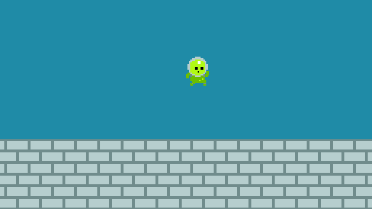

# GD50 (pyglet translation)

Projects from GD50 Intro. to Game Development (Harvard), but translated from 
Lua with LOVE to Python with pyglet.

You can see the course in Edx:

[https://www.edx.org/course/cs50s-introduction-to-game-development](https://www.edx.org/course/cs50s-introduction-to-game-development)

## Usage

Each project is enclosed on its own folder. To play one of the games just 
move to the project folder and run the *main* python script.

Ex:

`$ cd pong`

`pong/$ python main.py `

## Dependencies

For the projects to work you need to install the modules **pyglet** and 
**numpy**. You can do that with *pip* by running:

`python -m pip install pyglet numpy`

## Projects

### Pong

### Fifty-Bird

### Breakout

### Match3 (Unfinished)

### "Mario" (Work In Progress)

